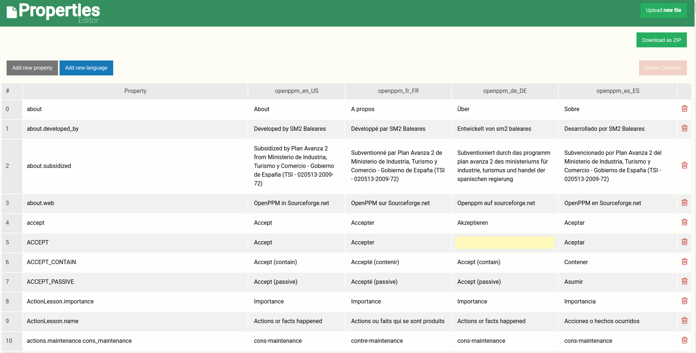

# Multi language Java properties editor

<br/> 



## Features
- Organizing multiple property language files as table
- Convert into ASCII symbols (only output)
- Generate new zip with edited / removed / added properties 

### Getting started
Get started with Multi language editor

#### Download Project
 
 ```bash
git clone https://github.com/11joselu/multi-language-editor.git
 ```
 
#### Compile Project
 
 ```bash
 $ cd multi-language-editor
 ```
  
 ```maven
 $ mvn clean install
 ```
 
 htttp:localhost:9080/
 
# Contribute

## Team members

* Jose Cabrera
* Raul Villalba

## Technologies
* Java
* Springboot
* Vue.js 2.x

## The MIT License (MIT)
   
   Copyright (c) 2017 Jose Cabrera, Raul Villalba
   
   Permission is hereby granted, free of charge, to any person obtaining a copy
   of this software and associated documentation files (the "Software"), to deal
   in the Software without restriction, including without limitation the rights
   to use, copy, modify, merge, publish, distribute, sublicense, and/or sell
   copies of the Software, and to permit persons to whom the Software is
   furnished to do so, subject to the following conditions:
   
   The above copyright notice and this permission notice shall be included in
   all copies or substantial portions of the Software.
   
   THE SOFTWARE IS PROVIDED "AS IS", WITHOUT WARRANTY OF ANY KIND, EXPRESS OR
   IMPLIED, INCLUDING BUT NOT LIMITED TO THE WARRANTIES OF MERCHANTABILITY,
   FITNESS FOR A PARTICULAR PURPOSE AND NONINFRINGEMENT. IN NO EVENT SHALL THE
   AUTHORS OR COPYRIGHT HOLDERS BE LIABLE FOR ANY CLAIM, DAMAGES OR OTHER
   LIABILITY, WHETHER IN AN ACTION OF CONTRACT, TORT OR OTHERWISE, ARISING FROM,
   OUT OF OR IN CONNECTION WITH THE SOFTWARE OR THE USE OR OTHER DEALINGS IN
   THE SOFTWARE.